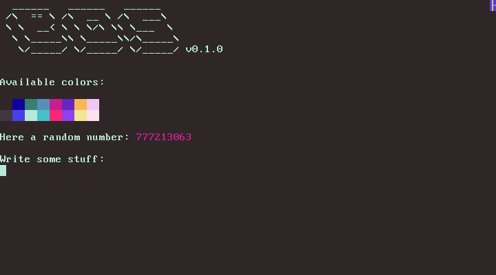

# Base OS

This repository serves as a basis for getting started with simple OS development.
It is a bare minimum kernel that uses the [Multiboot 2 Specification](https://www.gnu.org/software/grub/manual/multiboot2/multiboot.html) and [Grub](https://de.wikipedia.org/wiki/Grand_Unified_Bootloader) to start in 32-bit mode, enter custom assembly code to enter 64-bit mode and call the `kmain()` function in [kmain.c](./kernel/kmain.c).

Additionally, some utility functions are provided to write to the framebuffer (Textmode-80x25).

## Getting Started

For easier installation, building and running of the operating system two scripts `bos` and `bos.p1` are provided to make this process easier.

You can type

```shell
./bos help
```

to get an overview of which commands are available.

Alternatively on Windows the [bos.ps1](./bos.ps1) script (note that this requires bash and/or wsl to work properly as it basically executes the command with wsl) can be used and is executed like this:

```shell
.\bos.ps1 help
```

(Note that the ps1 could be omitted here)

## Setup

The two main components to build and run everything are [Docker](https://www.docker.com/) and [QEMU](https://www.qemu.org/), so make sure you have these two installed on your machine.
It is important that the `qemu-system-x86_64` component is installed since this OS template runs and compiles on x86_64.
Base OS uses a docker image specified by the [Dockerfile](./toolchain/Dockerfile) and its corresponding [install script](./toolchain/build-toolchain.sh).
This docker image contains everything required to build the OS.

To initially set the docker image up to build and run the OS simply type:

```shell
./bos setup
```

This can take quiet a while as it sets up the gcc cross-compiler as well as binutils for the x86_64-elf target and creates an image called bos-toolchain.
This image can be run as a container and inside this container you can run all necessary commands to build the operating system.

## How to build and run

Make sure you followed the steps above of [Installation](#installation).
Then you can build the OS with:

```shell
./bos make all
```

and after that run it with:

```shell
./bos qemu
```

or just simply chain them together:

```shell
./bos make build && ./bos qemu
```

You should than get a `build` directory in the root directory and in it an ISO file called `base_os.iso` which is the file that gets executed by **QEMU**.

## Debugging

### GDB

The built docker image comes with [**gdb**](https://www.sourceware.org/gdb/documentation/) and a custom .gdbinit file to make the output a little nicer.
First you have to start qemu in debugging mode:

```shell
./bos qemu-dbg
```

This starts the normal qemu instance with the additional arguments `-s -S`.
`-s` Causes qemu to listen for gdb to connect on port **1234** and `-S` causes it to wait while the connection has not been established yet.

In a separate terminal we can then start **gdb** with the following command:

```shell
./bos gdb
```

This should result in something similar to the following prompt when gdb connected to the qemu instance:

```
Reading symbols from ./build/boot/kernel.bin...
0x000000000000fff0 in ?? ()
dbg>
```

### Debug logging

Additionally, functions/defines inside the [debug.h](./kernel/include/debug.h) header can be used:

Single characters, though this is more or less used for the other functions:

```c
debug_char(<your_char>);
```
String, here you have to specify the maximal length of the string.
Printing also ends when a null byte is hit:

```c
debug(<your_string>, <string_length>);
```

And for convenient reasons a wrapper around `debug` for string literals so that you don't have to specify the string length:

```c
debug_literal(<your_string_literal>);
```

Now by default everything that is printed via the debug functions/defines goes to `stdout` over port `0xE9` defined in the debug header.
This can however be changed to log debug into a `serial.log` file inside the root directory by setting the `DEBUG_PORT` define inside the debug header to `COM1_PORT` which has the value `0x3F8`.

**TIP**: To make your debug statements a bit more expressive in the log use [ANSI Escape Codes](https://en.wikipedia.org/wiki/ANSI_escape_code) to color them (this however only makes sense when you print to stdout):

```c
debug_literal("[\x1b[33mDEBUG\x1b[m]: print some useful information for debugging here\n");
```

produces:

<code>[<span style="color: #C19C00">DEBUG</span>]: print some useful information for debugging here</code>

## Other script things

You could for example also just type:
```shell
./bos run
```
This will run the bos-toolchain image as container and you than have access to this instance on the terminal and should get a prompt like this:
```
/opt #
```
There commands can be executed just as in any normal linux environment.
For example, to now build the OS you can just type:
```shell
make all
```

## Screenshot

A screenshot of what you get to see when initially starting up the OS at the time of writing this:



Credit goes to https://patorjk.com/ for providing an awesome ASCII text generator that was used to make the logo.

## Planned

- [x] I/O with `outb` and `inb` instructions
- [x] Debug printing over stdout (requires I/O)
- [x] Adjusting colors in text mode (requires I/O)
- [x] Printing functions
- [x] Use docker image for building
- [x] `rdtsc` instruction wrapper
- [x] Simple pseudo random number generator ([linear congruential generator](https://en.wikipedia.org/wiki/Linear_congruential_generator))
- [x] Exceptions
- [x] Simple interrupts with [PIC](https://wiki.osdev.org/8259_PIC) (timer and keyboard interrupts, requires I/O)
- [x] Parsing multiboot info structure
- [x] Higher half kernel at 0xFFFFFF8000000000
- [ ] Kernel panics
- [ ] Simple lock (spin-lock, with `xchg` instruction)
- [x] Simple kernel memory management (page-manager and `kmalloc`)
- [ ] Simple file system
- [ ] Simple multitasking (scheduler)
